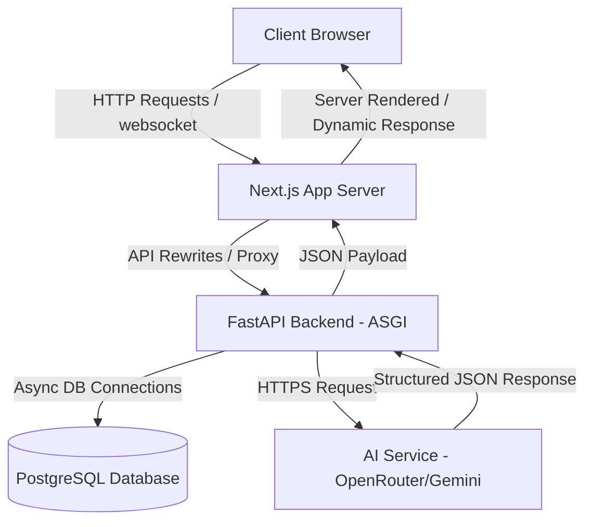
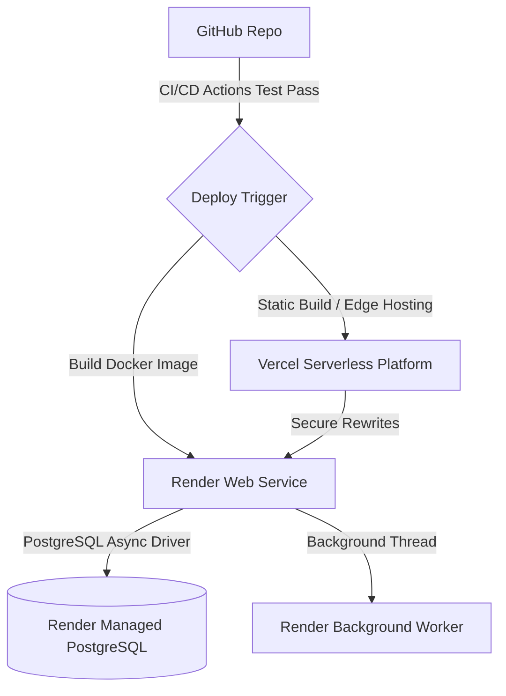
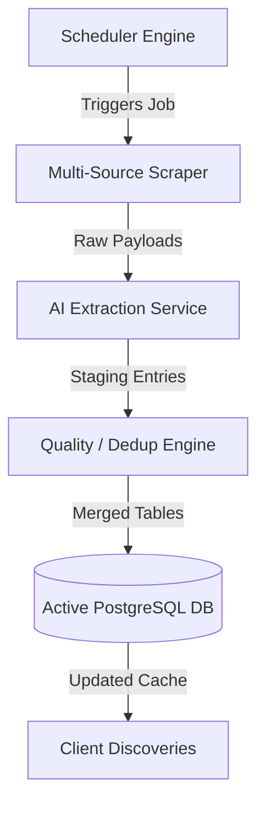

# GovSchemeAI

### *AI-Powered Government Scheme Discovery Platform for India*

[](https://nextjs.org/)
[](https://fastapi.tiangolo.com/)
[](https://www.python.org/)
[](https://www.typescriptlang.org/)
[](https://www.postgresql.org/)
[](https://www.docker.com/)
[](https://vercel.com/)
[](https://render.com/)
[](https://opensource.org/licenses/MIT)
[](https://github.com/)
[](https://github.com/)

---

## 📸 Placeholders & Demos

### Project Banner
```
+------------------------------------------------------------------------------------------+
|                                                                                          |
|                                       GovSchemeAI                                        |
|                       Government Scheme Discovery Platform for India                     |
|                                                                                          |
+------------------------------------------------------------------------------------------+
```
*(Visual banner design goes here in production deployment)*

### Project Screenshots
* **Homepage**: `[Insert Homepage Screen: Elegant dark-mode hero showcasing the citizen input cards]`
* **Eligibility Questionnaire**: `[Insert Questionnaire Screen: Interactive stepper validating age, income, and state constraints]`
* **Browse Schemes**: `[Insert Directory Screen: Paginated data tables featuring robust categories and search filters]`
* **AI Chat Assistant**: `[Insert Assistant Screen: Conversational RAG interface processing deep queries with source links]`
* **Admin Dashboard**: `[Insert Admin Screen: Analytics charts showing search queries, metrics, and background logs]`

### Interactive Demo
* **Live Web App**: [https://govscheme-ai.vercel.app](https://github.com/devanshr99) *(Placeholder for production preview)*
* **Backend API Docs**: [https://govscheme-ai-api.onrender.com/docs](https://github.com/devanshr99) *(Placeholder for production API Swagger docs)*

---

## 🇮🇳 Introduction & Motivation

### The Real-World Problem
India has thousands of welfare schemes launched by the Central Government and 28+ State Governments. Together, these programs represent billions of dollars in allocated resources intended for healthcare, education, agriculture, social security, and direct financial benefits. However, a significant percentage of eligible beneficiaries never receive these services.

The primary barriers include:
* **Information Fragmentation**: Information is scattered across hundreds of department-specific websites, each using its own layout, terminology, and navigation.
* **Complex Eligibility Matrix**: Understanding if a citizen qualifies is challenging. Eligibility is governed by intersecting factors including state, district, age, caste, gender, income, occupation, and land-ownership parameters.
* **Poor User Experience**: Traditional government portals are often slow, lack mobile responsiveness, and fail to provide natural language search capabilities.

### The GovSchemeAI Solution
**GovSchemeAI** bridges the gap between citizens and their welfare benefits by leveraging modern artificial intelligence, high-performance web engineering, and automated background data orchestration. 

Our platform:
1. **Aggregates & Normalizes**: Automatically crawls multi-source portals (such as myScheme, Data.gov.in, and official state gazettes).
2. **AI-Enriches**: Extracts structured rules (e.g. eligibility thresholds, benefit amounts, required documents) using LLMs to create clean data records.
3. **Optimizes Discovery**: Employs an interactive questionnaire stepper and a vector-enabled AI Assistant to guide users directly to the schemes they qualify for in seconds.

---

## 🛠️ Key Features & Capabilities

### Feature Matrix

| Feature | Subsystem | Description | Recruiter Value |
| :--- | :--- | :--- | :--- |
| **AI Assistant** | RAG Pipeline / LLM | Chat with a context-aware assistant. Answers natural language queries regarding documents and steps. | LangChain, Vector Embeddings |
| **Eligibility Checker** | Rules Engine | Checks demographic attributes (age, state, income, gender, etc.) against complex, multi-operator rules. | Complex Logic, High Performance |
| **Intelligent Search** | Full-Text Engine | Dynamic, real-time keyword matching across titles, ministries, and descriptions in both Hindi and English. | Multi-lingual Search Indices |
| **Browse & Filter** | Scheme Catalog | Pagination, state/central filtering, and category browsing (e.g. Agriculture, Education). | Optimized Database Queries |
| **Admin Dashboard** | Admin Control Panel | View scrapers, database statistics, sync runs, worker pool telemetry, and trigger backups. | Production Ops, Admin Security |
| **Scheduler** | Daemon Service | In-process daemon executing periodic sync cycles, crawling, and AI parsing. | APscheduler, Queue Management |
| **Database Sync** | Transaction Engine | Safely merges scraped/validated schemas from staging into active system records. | ACID Transactions, Locking |
| **Responsive UI** | UI Layouts | Modern frontend with Glassmorphism, animations, and fully-responsive layout sheets. | UX Design, Next.js Tailwinds |
| **Dark Theme** | Theme Engine | Curated dark mode design palette featuring TailwindCSS and Lucide React. | Modern Visual Aesthetics |
| **Docker** | Containerization | Ready-to-go `docker-compose` setting up FastAPI, Next.js, and PostgreSQL instantly. | DevOps, Local Reproducibility |
| **Health Monitoring** | Diagnostics | Complete diagnostic dashboard with `/live`, `/ready`, and `/metrics` (Prometheus API). | SRE, Kubernetes-style Probes |
| **API Docs** | OpenAPI | Standardized, self-documenting endpoints powered by FastAPI. | REST API Design |
| **Logging & Telemetry** | Log Pipeline | Centralized structured logs and metric collections reporting memory, latency, and throughput. | Production Monitoring |

---

## 📐 System & Subsystem Architectures

### 1. System Dataflow Architecture
The application runs as a multi-tier decoupled system. Requests are routed through Next.js proxy rewrite paths for unified endpoint access, maintaining frontend CORS isolation:



### 2. Deployment Architecture
Our cloud infrastructure utilizes fully containerized environments and managed cloud platforms, configured for zero-downtime releases:



### 3. Scheduler & Sync Architecture
Automatic extraction runs continuously in the background, keeping scheme definitions accurate and up-to-date:



---

## 📂 Project Directory Structure

```
GovSchemeAI/
├── backend/                # ASGI FastAPI Backend Server
│   ├── app/                # Main Application Package
│   │   ├── migrations/     # Multi-phase DB Migrations (Phases 2-18)
│   │   ├── models/         # SQLAlchemy ORM Data Models
│   │   ├── routers/        # API Controller endpoints
│   │   ├── schemas/        # Pydantic data validation schemas
│   │   ├── scrapers/       # Custom BeautifulSoup / API crawlers
│   │   ├── services/       # Core business logic pipelines (AI, Sync, Queue)
│   │   ├── utils/          # Logging, seed generators, and monitoring
│   │   └── main.py         # Application Entry Point & Middlewares
│   ├── tests/              # Extensive unit and integration test suite
│   ├── Dockerfile          # Production Docker container build script
│   └── requirements.txt    # Python dependencies list
├── frontend/               # Next.js Front-End Client
│   ├── src/                # Source Directory
│   │   ├── app/            # App Router (Pages, Layouts, CSS)
│   │   ├── components/     # UI elements, Forms, Questionnaires, Layouts
│   │   ├── context/        # Global React Context providers
│   │   ├── lib/            # Axios API wrappers & network configurations
│   │   └── types/          # Shared TypeScript Interfaces
│   ├── Dockerfile          # Frontend container definition
│   └── package.json        # Next.js package metadata & scripts
├── docs/                   # Detailed Engineering Documentation Guides
├── scripts/                # Database backup and diagnostic scripts
├── docker-compose.yml      # Multi-container orchestration configurations
└── README.md               # Hero documentation file
```

---

## 💻 Technology Stack Justification

| Technology | Layer | Use Case | Rationale |
| :--- | :--- | :--- | :--- |
| **Next.js 15** | Frontend | User Interface & SSR | Dynamic App routing, server-side data fetching, and page optimization for SEO metrics. |
| **FastAPI** | Backend | High-Speed REST API | Asynchronous (asyncio) request lifecycle, auto OpenAPI docs, fast development. |
| **PostgreSQL** | Database | Primary Datastore | Relational integrity, robust concurrency locks, and native JSON query support. |
| **SQLAlchemy** | Database | Async ORM Mapper | Object-relational mapping with native `asyncio` loop, connection pool options. |
| **Docker** | Container | Orchestration | Isolates execution environments across Development, Staging, and Production. |
| **Render** | Hosting | Web & Worker Server | Integrated background worker tasks, managed databases, simple Docker deployments. |
| **Vercel** | Hosting | Static Edge Delivery | Fast edge networks, serverless frontend execution, auto preview environments. |
| **TypeScript** | Language | Type-Safety | Enforces contracts across components, APIs, and models, reducing runtime exceptions. |

* **Why FastAPI over Django?** FastAPI allows us to run background workers and high-concurrency scraping operations in the same Python process without blocking the main thread, while offering native support for async PostgreSQL.
* **Why Next.js App Router?** It allows us to perform Server Side Rendering (SSR) for SEO-sensitive scheme detail pages, while retaining single-page app responsiveness for dynamic eligibility questionnaires.

---

## 🗄️ Database Design Overview

The database uses a clean, relational schema designed for version control, scheme lifecycle auditing, and elastic user management.

* **Core Tables**:
  * `schemes`: Holds the official details, metadata, source URL, and AI-confidence metrics.
  * `eligibility_rules`: Multi-operator rule structures linking 1:N with schemes to define requirements.
  * `categories`: Master scheme categories with icon codes and theme color specifications.
  * `states` & `districts`: Normalized geographical indices used for state-level eligibility checking.
  * `users` & `user_schemes`: Dynamic bookmarks linking users to their matching schemes.
* **Audit & Operation Tables**:
  * `scheme_versions`: Logs the full database state of schemes on edit to enable rollback operations.
  * `audit_logs`: Detailed metadata trails tracing who edited which field.
  * `update_runs`: Logs background crawling sessions, recording total records fetched, runtimes, and exceptions.
  * `scheme_staging`: Temporary workspace holding raw parsed records awaiting admin validation.
  * `scheduler_jobs` & `queue_jobs`: Controls dynamic in-memory queue states and chronologies.

---

## 🔌 API Catalog Overview

Below is a highlight of key endpoints. For full payload details, refer to the [API Documentation Guide](file:///c:/Users/devan/Desktop/government%20schemes/GovSchemeAI/docs/api.md) or access `/docs` on a running server.

| Method | Endpoint | Description | Auth Required |
| :--- | :--- | :--- | :--- |
| **GET** | `/health` | Diagnostic readiness probe (DB, Worker status). | None |
| **GET** | `/schemes` | Returns paginated list of schemes with filters. | None |
| **POST** | `/eligibility/check` | Compares citizen input profile to rules matrix. | None |
| **POST** | `/chat/ask` | natural language chat endpoint (RAG lookup). | None |
| **POST** | `/admin/updates/trigger` | Triggers background crawling workflow. | Admin JWT |
| **GET** | `/analytics/reports` | Fetches historical graphs for schemes & searches. | Admin JWT |
| **POST** | `/backup/create` | Triggers automated backup creation pipeline. | Admin JWT |

---

## 🚀 Installation & Local Development Setup

### System Prerequisites
* Python 3.11 or higher
* Node.js v20.x or higher
* PostgreSQL v15+ (if running without Docker)
* Docker Desktop (recommended)

### Approach 1: Rapid Docker Boot (Recommended)
1. Clone this repository:
   ```bash
   git clone https://github.com/devanshr99/GovSchemeAI.git
   cd GovSchemeAI
   ```
2. Create standard environment configurations (see [Environment Guide](file:///c:/Users/devan/Desktop/government%20schemes/GovSchemeAI/docs/environment.md)).
3. Spin up the containers:
   ```bash
   docker-compose up --build
   ```
4. Access client at `http://localhost:3000` and API at `http://localhost:8000`.

### Approach 2: Manual Developer Setup
#### 1. Backend Service
```bash
cd backend
python -m venv .venv
source .venv/Scripts/activate  # Linux/macOS: source .venv/bin/activate
pip install -r requirements.txt
# Populate backend/.env based on .env.example
uvicorn app.main:app --reload
```

#### 2. Frontend Client
```bash
cd frontend
npm install
# Populate frontend/.env based on .env.example
npm run dev
```

---

## 🗺️ Project Roadmap & Next Steps

- [ ] **WhatsApp/SMS Bot Integration**: Provide accessibility channels for users without smartphones.
- [ ] **Voice Search Support**: Implement voice queries in local regional languages.
- [ ] **Multi-lingual LLM Translation**: Real-time conversion of scheme details to 12+ local Indian languages.
- [ ] **Direct Offline Form Generation**: Pre-fill PDF application documents based on checked eligibility profiles.

---

## 🤝 Contributing

We welcome contributions from open-source developers, SREs, and designers! Please read our [Contributing Guide](file:///c:/Users/devan/Desktop/government%20schemes/GovSchemeAI/docs/contributing.md) to understand linting rules, issue-logging policies, and merge request workflows.

---

## 📄 License
Distributed under the **MIT License**. See [LICENSE](file:///c:/Users/devan/Desktop/government%20schemes/GovSchemeAI/LICENSE) for more information.

---

## 👨‍💻 Author & Maintained By

* **Devansh Rastogi**
* **GitHub**: [github.com/devanshr99](https://github.com/devanshr99)
* **Email**: [devanshrastogi993@gmail.com](mailto:devanshrastogi993@gmail.com)