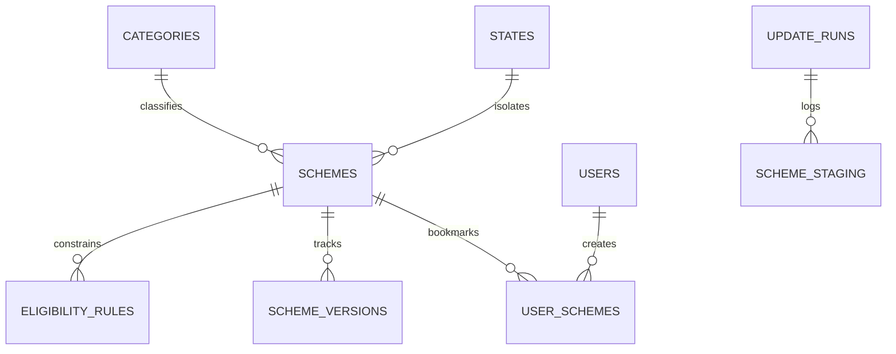

# Database Design & Schema Guide

This document describes the schema architecture, relationships, indexes, and custom multi-phase migration system of the **GovSchemeAI** database.

---

## 📊 Entity Relationship Diagram

The following diagram illustrates relationships between primary models.

---

## 🗄️ Core Database Tables

### 1. `schemes`
Main store for government benefits metadata.
* **Primary Key**: `id` (VARCHAR(36), UUID string).
* **Indexes**: 
  * `slug` (Unique): For SEO-optimized page routing lookup.
  * `status`: Filters active/inactive/deleted states.
  * `last_seen` & `last_checked`: Pinpoints chronological refresh runs.
* **Relations**:
  * Links 1:1 with `categories` on `category_id`.
  * Links 1:1 with `states` on `state_code` (nullable for Central schemes).
  * Has N `eligibility_rules`.

### 2. `eligibility_rules`
Fine-grained rules mapping to schemes.
* **Structure**: Each row represents a single constraint.
* **Columns**:
  * `rule_type`: (e.g. `age`, `income`, `gender`, `caste`, `state`).
  * `operator`: (e.g. `eq`, `gte`, `lte`, `between`, `in`, `bool`).
  * `value` (JSON): Dynamically matches rule types. e.g. `{"min": 18, "max": 40}` or `["ST", "SC"]`.
  * `is_mandatory` (Boolean): Defines if rule is strict or optional.

### 3. `categories`
Categories catalogue (e.g., Education, Agriculture, Health).
* **Columns**: `id` (PK, Serial), `slug` (Unique), `name`, `name_hi` (Hindi translation), `icon` (Emoji/lucide string), `color` (Hex styling code).

### 4. `states` & `districts`
Geographical reference indexes ensuring demographic lookup data safety.

### 5. `users` & `user_schemes`
Tracks registrations, admin controls, and citizen bookmarks.

---

## 🔍 Indexes & Performance Tuning

To optimize real-time filtering, the database schema implements selective indexing:
1. **Search Indexing**: Scheme `name`, `ministry`, and `department` fields feature standard indexing. Production environments on PostgreSQL use native full-text search indexes (`gin` index on search vectors).
2. **Composite Indexes**: The staging and scraper auditing modules utilize combined indexes over timestamp columns to speed up dashboard dashboard rendering.
3. **Cascades**: Eligibility rules and audit logs have cascading deletes (`ondelete="CASCADE"`) linked to the primary scheme record.

---

## 🔄 Dynamic Database Migrations

Rather than running heavy offline database command shells (e.g. Alembic) during cluster deployment, GovSchemeAI features a programmatic, multi-phase migration system running on startup.

* **Lifecycle Orchestration**: During FastAPI startup, the database lifespan execution checks the database version and executes the following migrations sequentially:
  * `db_migration_v2.py`: Scheme intelligence properties addition (status, seen, confidence metrics).
  * `db_migration_v3.py`: Government source registries tables.
  * `db_migration_v5.py`: AI extraction staging schema initialization.
  * `db_migration_v9.py`: Audit trails and version histories trackers.
  * `db_migration_v11.py`: Background scheduler cron configuration storage.
  * `db_migration_v15.py`: Search optimization index registers.
  * `db_migration_v18.py`: Connection performance parameters.
* **Benefits**: 
  * Seamless container updates without deployment orchestration scripts.
  * DB tables are automatically created or updated on any server launch (Docker, local, or cloud environment).
